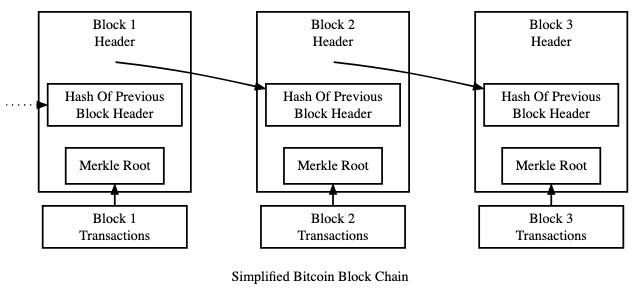

# Block nedir ?

Bir blok, bir dizi işlemi içeren ve önceki bloğun hash değerini içeren veri yapısıdır. Her blok, bir önceki bloğun hash değeriyle bağlanır, böylece bir zinciri yani blockchaini oluşturur. Blockchain'deki blokların birbirine bağlı olmasından dolayı blok zincirlerin `değişmez (immutable)` olması sağlanır.&#x20;


Bir bloğun değiştirilmesi, o bloktan sonraki tüm blokların hash'lerini değiştirmeyi gerektirir ki bu, pratikte imkansızdır.


<figure><figcaption>
Bir bloğun anatomisi
</figcaption></figure>

Blockchain'lerde blok'ların genelde 3 bölümü bulunmaktadır.

### 1. Blok Başlığı (Block Header)

Blok başlığı, blok hakkında meta veriler içerir ve aşağıdaki önemli alanları içerir:

* **Önceki Blok Hash'i (Previous Block Hash):** Bu alan, önceki bloğun hash'ini içerir. Bu sayede bloklar birbirine zincirleme olarak bağlanır ve blockchain adı verilen yapıyı oluşturur.
* **Merkle Kökü (Merkle Root):** Bu alan, bloğun içinde yer alan tüm işlemlerin hash'lerini özetleyen bir hash değeri içerir. Merkle ağacı, işlemlerin bütünlüğünü ve hızlı doğrulanmasını sağlar.
* **Zaman Damgası (Timestamp):** Blok oluşturulduğunda kaydedilen tarih ve saat bilgisi.
* **Nonce:** İşlemci gücü kullanarak belirli bir zorluk seviyesine göre bulunan, Proof of Work (PoW) konsensusu için kullanılan rastgele bir sayı.
* **Hedef Zorluk (Difficulty Target):** Blok madenciliği sürecindeki zorluk seviyesini belirler.

### 2. İşlemler Listesi (Transaction List)

Blokların ana içeriği, o blok içinde doğrulanan işlemlerden oluşur. Her blok, blockchain ağına gönderilen ve doğrulanan birçok işlemi içerir. İşlemler, blok başlığındaki Merkle Root/Kök ile özetlenir.

### 3. İşlemler (Transactions)

Her bir işlem, genellikle aşağıdaki bilgileri içerir:

* **Gönderen Adresi (Sender Address):** İşlemi başlatan kullanıcının adresi.
* **Alıcı Adresi (Receiver Address):** İşlemin gönderildiği kullanıcının adresi.
* **Miktar (Amount):** Gönderilen dijital varlık miktarı.
* **İşlem Ücreti (Transaction Fee):** Madencilere ödenen ücret.
* **İşlem ID'si (Transaction ID):** İşlemi benzersiz kılan kimlik numarası.
