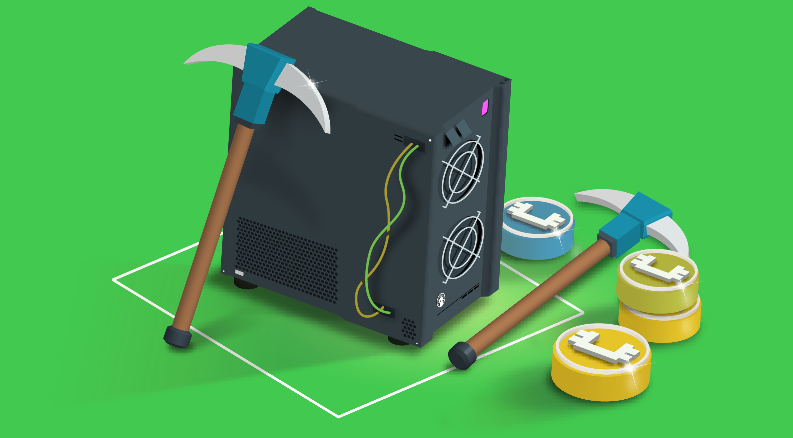

# Blockchain Madencliği

Blockchain ağı üzerinde yeni bloklar oluşturmak ve bu bloklara dahil edilen işlemleri doğrulamak için bir takım karışık matematiksel problemler çözülmesi gerekmektedir. Bu matematiksel problemleri çözme işlemine madencilik/mining denir, bu işleri yapan kişilere ise madenci/miner denilmektedir.

Madencilik genelde Bitcoin gibi `"Proof of Work"` konsensus yöntemini kullanan ağlarda yapılır.

Madenciler blockchain'de yeni bloklar oluşturmak ve ağın güvenliğini sağlamak için bilgisayarlarının işlem gücünü kullanarak matematiksel işlemler yaparlar. Bunun karşılığında da madencilik yaptığı blockchain'deki coin'den ödül olarak alırlar.

Burada madenciler bilgisayarlarına kurduğu sistem ile madencilik yaparak;

* Ağdaki kullanıcıların işlemlerini doğrulamak ve bu işlemleri içeren yeni bloklar oluşturmak için SHA-256 hash fonksiyonunu kullanarak blokları zincire eklerler
* İşlemleri doğrulayarak ve yeni bloklar ekleyerek ayrıca ağın bütünlüğünü de korumuş olurlar.

<figure><figcaption>
Blockchain Madencliği
</figcaption></figure>

### Madencilik Süreci

Madencilik süreci genellikle aşağıdaki adımlardan oluşur:

**a. İşlemlerin Toplanması**

Blockchain ağı üzerinde yapılan işlemler, geçici bir havuzda (mempool) toplanır. Madenciler, bu havuzdan işlemleri seçer ve bir blok adayı oluşturur.

**b. Blok Adayının Oluşturulması**

Madenciler, belirli bir boyuta ve kurallara uygun olarak bir blok adayı oluşturur. Bu blok, seçilen işlemleri ve belirli meta verileri (zaman damgası, önceki blok hash'i, nonce, vb.) içerir.

**c. Kriptografik Bulmacanın Çözülmesi**

Madenciler, blok adayını geçerli kılmak için belirli bir kriptografik bulmacayı çözmeye çalışır. Bu bulmaca, genellikle hash fonksiyonlarını kullanarak belirli bir zorluk seviyesine ulaşmayı gerektirir. Bu süreç, "Proof of Work" (PoW) olarak adlandırılır.

**d. Bulmacanın Çözülmesi ve Blok Eklenmesi**

Madenci, doğru nonce değerini bularak bulmacayı çözdüğünde, yeni blok oluşturulur ve blockchain ağına eklenir. Bu blok, önceki blokların hash'ini içerdiği için zincirin bir parçası haline gelir.

**e. Ödüllendirme**

Başarılı madenci, blok ödülü ve işlem ücretleri ile ödüllendirilir. Blok ödülü, yeni oluşturulan kripto paralar ve blokta yer alan işlemler için ödenen ücretleri içerir.

### Madencilik Zorluk Derecesi ve Ayarlama

Madenciler blokları bulabilmek için o bloğun nonce değerini bulmalıdır.

Blockchain ağları ise, belirli aralıklarla madencilik zorluk derecesini/nonce değeri ayarlar. Zorluk derecesi, blokların belirli bir süre içinde (örneğin, Bitcoin için ortalama 10 dakika) çıkarılmasını sağlamak için ayarlanır. Madencilik gücü arttığında zorluk derecesi artar, azaldığında ise düşer. Bu ayarlama, ağın istikrarını ve güvenliğini sağlar.

<figure><figcaption>
Blockchain Yapısı
</figcaption></figure>

Nonce değerini sistem varsayılan olarak kendisi ayarlar ve madencilerin block’u bulması için zorluk değerini gösterir. Daha fazla sayıda 0 içeren bir hash değeri bulmak, daha fazla hesaplama gücü gerektirir ve bu da madencilik sürecini daha zor ve enerji yoğun halde getirir dolayısıyla ağın güvenliğini de daha fazla arttırmış olur.

Ayrıca zorluk seviyesi, ağın toplam hesaplama gücüne göre ayarlanarak, blokların bulunma hızını dengelemeyi amaçlar.

