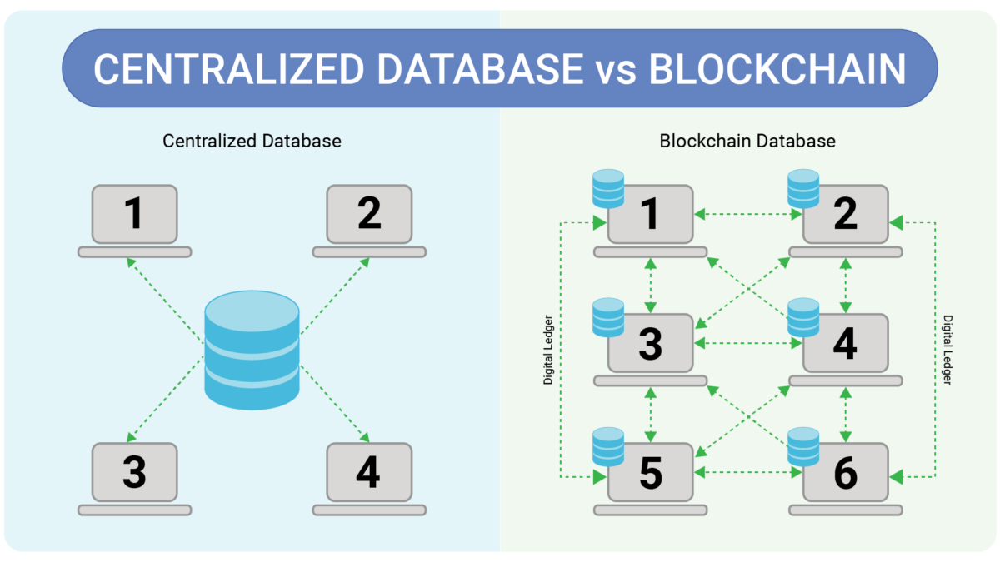

# ⛓️ Blockchain nedir ?

Web3'ün en önemli teknolojisi blockchain yani blok zinciridir. Blockchain kavramı daha önceki yıllarda birçok kez ortaya atılsa da tam olarak kullanılması 2008 yılında Satoshi Nagamoto'nun "Bitcoin: A Peer-to-Peer Electronic Cash System" adlı manifestosu ile olmuştur. Nagamoto (kişi veya kurum) bu white paper ile o günün ekonomik istikrarsızlığına baş kaldırarak bir internet devriminin başlamasına sebep olmuştur.

Blockchain'i kısaca tanımlamak istersek; dağıtık defter teknolojisi kullanan, geri döndürülemez, şeffaf ve güvensiz güven sağlayan, P2P (eşten eşe), anonim bir teknoloji olarak tanımlayabiliriz.

<figure><figcaption>
Merkezi Veritabanı ve Blockchain
</figcaption></figure>

Şimdi gelin bu tanımlara tek tek bakalım.

Blockchain, dağıtık defter teknolojisinin (DLT) bir türüdür. DLT yani Distributed Ledger Technology, verilerin merkezi bir otoriteye ihtiyaç duymadan birçok düğüm (node) arasında paylaşıldığı bir yapıdır. Bu yapı, tüm düğümlerin aynı anda güncellenen bir kayıt tutmasını sağlar.

Blockchain üzerinde bir kez kaydedilen veriler, değiştirilmesi veya silinmesi neredeyse imkansız olan bir yapıya sahiptir. Bu özellik, her bloğun önceki blok ile kriptografik olarak bağlı olmasından kaynaklanır. Bir bloğun değiştirilmesi, o bloğun ve sonrasındaki tüm blokların yeniden hesaplanmasını gerektirir, bu da pratikte çok zordur.

Blockchain, herkesin verileri görüntüleyebileceği açık bir defterdir. Her işlem, ağdaki tüm düğümler tarafından görülebilir ve doğrulanabilir. Bu şeffaflık, sistemin güvenilirliğini artırır.

Blockchain, "güvensiz güven" veya "trustless trust" denilen bir konsepti kullanır. Yani, kullanıcılar birbirlerine güvenmek zorunda kalmadan, sistemin kendisine güvenirler. Bu, kriptografi ve konsensus algoritmaları ile sağlanır. İşlemlerin doğruluğu, merkezi bir otoriteye gerek kalmadan ağdaki tüm düğümler tarafından doğrulanır.

Blockchain, eşler arası (P2P) bir ağ yapısına sahiptir. Bu, ağdaki tüm düğümlerin doğrudan birbirleriyle iletişim kurduğu anlamına gelir. Merkezi bir sunucuya ihtiyaç duyulmaz. Bu yapı, sistemin daha dayanıklı ve merkezi olmayan bir şekilde çalışmasını sağlar.

Blockchain, kullanıcıların anonim kalmasına olanak tanır. Kullanıcılar, işlemlerini gerçekleştirmek için gerçek kimliklerini ifşa etmek zorunda kalmazlar. Bunun yerine, işlemler dijital imzalar ve adresler aracılığıyla gerçekleştirilir. Ancak, bu anonimlik derecesi blockchain türüne göre değişebilir. Örneğin, Bitcoin gibi bazı blockchain ağları yarı anonim iken, Monero gibi diğerleri tam anonimlik sağlar.

<figure><figcaption>
Blockchain İletişim Katman Şeması
</figcaption></figure>
