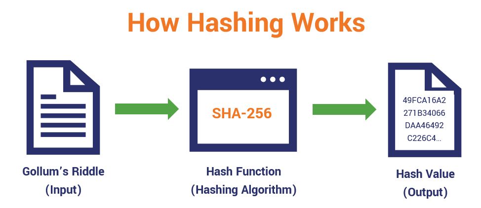

# Hashing

## Hashing nedir ?

Girdiyi (veriyi) alarak sabit uzunlukta ve benzersiz bir çıktı (hash değeri) üreten matematiksel algoritmalardır.

Blockchain’de her bloktaki mesajlar hash olarak diğer bloğa iletilir ve böylece hashlenerek boyutu sıkıştırılmış olur.

<figure><figcaption></figcaption></figure>

### Hash Fonksiyonların Özellikleri

* Deterministik Olma
* Hızlı Hesaplanabilirlik
* Çıktının Sabit Uzunlukta Olması
* Çarpışma Direnci (Collision Resistance)
* Özet Değerin Geri Dönüşümsüz Olması (One-Way Function)
* Küçük Değişikliklerin Büyük Farklar Yaratması (Avalanche Effect)

## SHA-256 Nedir ?

Verilerin sabit uzunlukta bir hash değeri ile temsil edilmesini sağlar.

SHA-256, verilerin güvenli bir şekilde hashlenmesini sağlar ve Bitcoin gibi birçok blockchain protokolünde kullanılır.

Girdi => Herhangi bir uzunlukta veri girişi.

İşlem => Veri, SHA-256 algoritması ile işlenir.

Çıktı => 256-bit (32-byte) sabit uzunlukta hash değeri

Olası Çıktı Sayısı: 1.16 x 10^77


Bir SHA-256 fonksiyonun olası çıktı sayısı 10^77 ve gözlemlenebilir evrendeki atom sayısı ise 10^80 olarak ölçüldüğü göz önüne alındığında hashing algoritmalarının ne kadar güvenli olduğu daha net anlaşılmaktadır.

