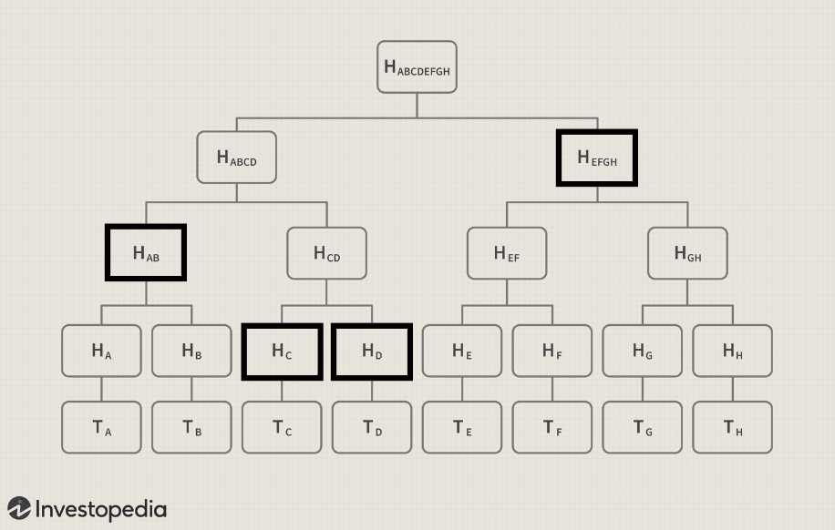
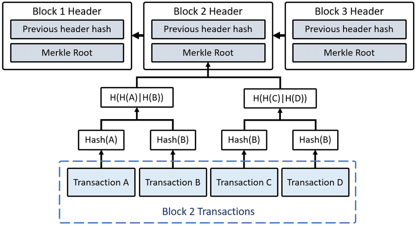
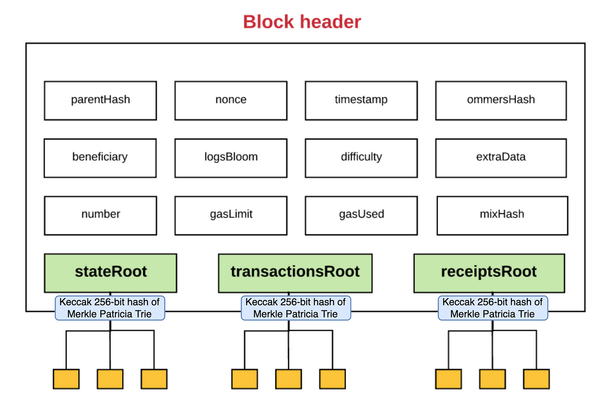

# Markle Tree

Büyük veri setlerinin doğrulanmasını ve bütünlüğünün korunmasını sağlamak için kullanılan bir kriptografik veri yapısıdır. Verilerin hash değerleriyle oluşturulan bir ağaç yapısıdır. Bu sayede veriler hızlı ve verimli bir şekilde doğrulanabilir.&#x20;

Blockchain ile birlikte gelmemiştir, mongoDB gibi dağıtık veri tabanlarında sıkça kullanılan bir yöntemdir.

<figure><figcaption></figcaption></figure>

Veritabanından bir bilginin olup olmadığını sorgulamak istediğiniz zaman her veriyi tek tek sorgulamak yerine merkle root'ta bulunan dalların bazılarını alıp kontrol etmeniz yeterlidir.

Yukarıdaki görselde oluşturulan merkle ağacında en altta bulunan her transaction (T) hashlenerek bir hash kodu oluşturulur. Daha sonra her bir hash tekrar kendi aralarında hashlenerek yeni bir hash kodu oluşturur. Böylece sıkıştırılmış veriler tek bir hash kodu olarak bloğa yazılır.

Blok'taki veriyi sorgulamak istediğinizde ise Hab, Hc ve Hd yi aldıktan sonra ağacın diğer dalında olup olmadığını hızlı bir şekilde sorgulayabilirsiniz.

Dağıtık veri tabanlarında ise merkle ağacı kullanırken görsel, metin, pdf gibi veriler sıkıştırılabilmektedir.

## Blockchain'de Markle Tree Kullanımı

Merkle Tree, blockchain'lerde verilerin hızlı ve güvenli bir şekilde doğrulanmasını sağlar. Her blok, işlemlerin Merkle root hash'ini içerir, bu da işlemlerin bütünlüğünü garanti eder.

<figure><figcaption></figcaption></figure>


Ethereum'da adreslerin oluşturulması, işlemlerin doğrulanması ve blokların ve akıllı sözleşmelerin hashlerinin hesaplanması gibi çeşitli işlemler için SHA-3 ailesinden Keccak-256 kullanır.


<figure><figcaption></figcaption></figure>
