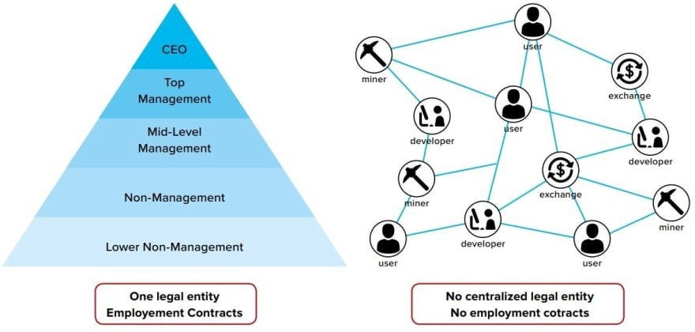

# DAO

DAO yani `Decentralized Autonomous Organization`'lar merkezi bir otoriteye ihtiyaç duymadan, topluluk tarafından yönetilen ve blokzincir teknolojisi üzerinde çalışan organizasyonlardır. DAO'lar, geleneksel organizasyonların aksine, karar alma süreçlerini merkezi bir otorite yerine blokzincir teknolojisi ve akıllı kontratlar üzerinden yürütürler.

DAO'larda kurallar genelde önceden programlanır/tanımlanır, belirli koşulların veya oy çokluğunun sağlanması durumunda otomatik devre alınırlar.

<figure><figcaption>
Geleneksel Organizasyon ve DAO
</figcaption></figure>

Yukarıdaki görselde bulunan geleneksel organizasyon yapısı ve DAO yapısını incelediğimizde geleneksel yöntemde talimatların tepeden aşağı olacak şekilde ilerlediğini görebiliriz. Burada bir karara ortak ve eşit katılım söz konusu değilken DAO yapısında bir karar ortaya atılır ve adil bir şekilde paydaşların katılımı sağlanır. DAO'lara katılım oranı paydaşların elinde bulundurduğu token adeti kadar olduğu için eşit bir katılımdan ziyade adil bir katılım söz konusudur.

DAO'ların geleneksel organizasyon yapısına göre belli başlı bazı avantajları bulunmaktadır.

* **Merkeziyetsizlik**: DAO'lar, merkezi bir otoritenin bulunmadığı organizasyonlardır. Yönetim ve karar alma süreçleri topluluk üyeleri tarafından gerçekleştirilir.
* **Otomasyon**: DAO'nun işleyişi, akıllı kontratlar tarafından yürütülür. Bu kontratlar, belirli kurallar ve koşullar sağlandığında otomatik olarak işlem yapar.
* **Topluluk Yönetimi**: DAO'lar, token sahiplerinin katılımıyla yönetilir. Her token sahibi, organizasyonun geleceği hakkında oy kullanma hakkına sahiptir. Oylar, DAO'nun karar alma süreçlerini belirler.
* **Şeffaflık**: Blockchain teknolojisi sayesinde, DAO'da alınan tüm kararlar ve yapılan tüm işlemler herkes tarafından görülebilir. Bu durum, organizasyonun şeffaflığını artırır.
