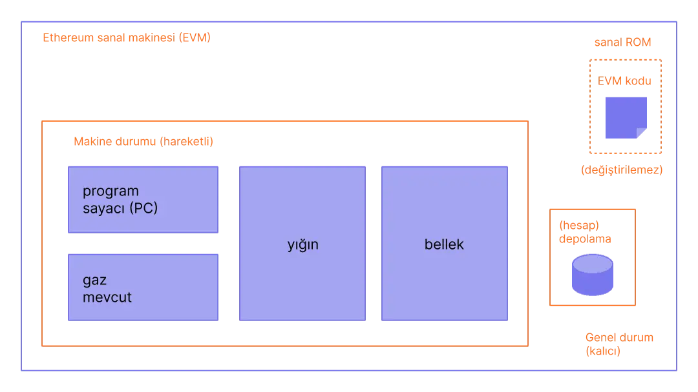

# EVM nedir ?

Ethereum Sanal Makinesi (EVM), Ethereum blockchain'inin merkezi bileşenlerinden biri olarak, Ethereum ağında akıllı sözleşmelerin ve merkezi olmayan uygulamaların (dApps) çalıştırılmasını sağlayan bir hesaplama motorudur. EVM, Ethereum ağındaki tüm düğümler (nodes) tarafından çalıştırılan bir `sanal makinedir` ve bu düğümler, EVM sayesinde aynı işlemleri aynı şekilde gerçekleştirerek ağın güvenliğini ve tutarlılığını sağlar.

<figure><figcaption>
EVM (Ethereum Virtual Machine)
</figcaption></figure>

## EVM'nin Temel Özellikleri

* **Turing Tamamlığı:** EVM, Turing tamamlayıcıdır, yani herhangi bir hesaplama problemini çözebilecek kapasitededir. Bu özellik, geliştiricilerin her türlü mantıksal işlemi gerçekleştiren akıllı sözleşmeler yazabilmesini sağlar. Ancak, bu geniş yetenekler sınırsız hesaplamaya izin vermez; EVM, işlem ücretleri (gas) aracılığıyla işlemlerin maliyetini dengeleyerek sonsuz döngüleri ve kötü niyetli kodları engeller.
* **Akıllı Sözleşmelerin Çalıştırılması:** EVM, akıllı sözleşmeleri derler ve çalıştırır. Akıllı sözleşmeler, geliştiriciler tarafından genellikle Solidity gibi yüksek seviyeli dillerde yazılır. Bu sözleşmeler daha sonra EVM tarafından anlaşılabilir bayt koduna dönüştürülür ve Ethereum ağı üzerindeki tüm düğümler tarafından çalıştırılır. Bu süreç, akıllı sözleşmelerin belirlenen koşullar sağlandığında otomatik olarak çalışmasını ve sözleşme taraflarının müdahalesi olmadan işlem gerçekleştirilmesini sağlar.
* **Dağıtılmış İşlem:** EVM, dağıtılmış bir işlem modeli sunar. Bu, Ethereum ağı üzerindeki her düğümün aynı akıllı sözleşmeyi çalıştırdığı ve aynı sonuçları ürettiği anlamına gelir. Bu özellik, ağın güvenilirliği ve merkeziyetsizliği için kritiktir; çünkü her düğüm, ağın geri kalanıyla senkronize çalışarak herhangi bir tekil hata noktasını ortadan kaldırır.
* **Gas ve İşlem Ücretleri:** EVM'nin çalışması, gas adı verilen bir işlem ücreti sistemi ile kontrol edilir. Gas, EVM'de yapılan her işlem için bir maliyet belirler. Bu sistem, ağdaki kaynakların (hesaplama gücü ve depolama) verimli kullanılmasını sağlar. Aynı zamanda, EVM'deki sonsuz döngülerin ve gereksiz hesaplama işlemlerinin önüne geçer. Kullanıcılar, işlemlerini gerçekleştirmek için yeterli gas ücreti ödemek zorundadır.


Gas Price, Gas Limit gibi terimler birbirinden farklı konulardır.\
**Gas Limit** bir işlem için harcayabileceğiniz maksimum gas miktarıdır.\
**Gas Price** ise işlem başına ne kadar gas ödemeye razı olduğunuzu belirler. Bu değer genellikle **gwei** cinsinden ifade edilir (1 gwei = 10^(-9) ETH).\
Ether, Gwei ve Wei dönüşümü için [burayı](https://eth-converter.com/) inceleyebilirsiniz.\
Birde **Gas Used** var ki o da bir işlem veya akıllı kontratın tamamlanması için harcanan toplam gas miktarını ifade etmektedir. Bunu kodunuzu optimize ederek daha da düşürmek elinizdedir.

Bir örnek vermek gerekirse;

* **Gas Limit:** 50,000 olarak belirlendiğini varsayalım.
* **Gas Price:** 20 gwei (Blockchain'in kullanımına bağlı olarak ağ tarafından belirlenir)
* **Gas Used:** 21,000 gwei ayarladık (Optimize edilirse daha da düşürülebilir)

Toplam maliyet = Gas Used × Gas Price formülüne göre,\
Toplam maliyet = 21,000 × 20 gwei \
Toplam maliyet=21,000 × 20 gwei \
Toplam maliyet = 420,000  gwei = 0.00042  ETH \
Toplam maliyet = 420,000 gwei = 0.00042 ETH


* **Platform Bağımsızlığı:** EVM, Ethereum ağında çalışan tüm akıllı sözleşmelerin her blockchain ağında çalışabilmesini sağlar. EVM, Ethereum ağını oluşturan binlerce düğüm arasında, her tür donanım ve yazılım ortamında aynı şekilde çalışacak şekilde tasarlanmıştır. Bu, EVM'yi güçlü ve esnek bir sanal makine haline getirir.


EVM üzerinde çalışan BSC, Polygon, Fantom, Arbitrum ve Optimizm gibi birçok blockchain ağı bulunmaktadır.


## EVM'nin Rolü ve Önemi

Ethereum Sanal Makinesi, Ethereum ekosisteminin merkezinde yer alır ve bu ekosistemin işleyişinde kritik bir rol oynar. Geliştiriciler, EVM sayesinde merkeziyetsiz uygulamalar ve akıllı sözleşmeler geliştirebilir, bu da Ethereum'u dünya çapında çok çeşitli kullanım alanlarında kullanılabilir hale getirir. EVM, akıllı sözleşmelerin güvenilirliğini, doğrulanabilirliğini ve değiştirilemezliğini garanti eder.

EVM'nin geniş çapta benimsenmesi ve Ethereum’un popülerliği, blockchain teknolojisinin daha ileri seviyelere taşınmasına katkıda bulunmuştur. Ethereum, bu yapı sayesinde merkeziyetsiz finans (DeFi), NFT'ler, DAO'lar ve diğer birçok yenilikçi blockchain tabanlı uygulama için ideal bir platform haline gelmiştir.

Sonuç olarak, Ethereum Sanal Makinesi, Ethereum ağının bel kemiğini oluşturan bir hesaplama ortamıdır. Geliştiricilere güçlü bir programlama ortamı sunarken, ağın güvenliği ve bütünlüğü için merkezi bir rol oynar. EVM'nin sağladığı esneklik ve güvenlik, Ethereum’u diğer blockchain platformlarından ayıran en önemli özelliklerinden biridir.
