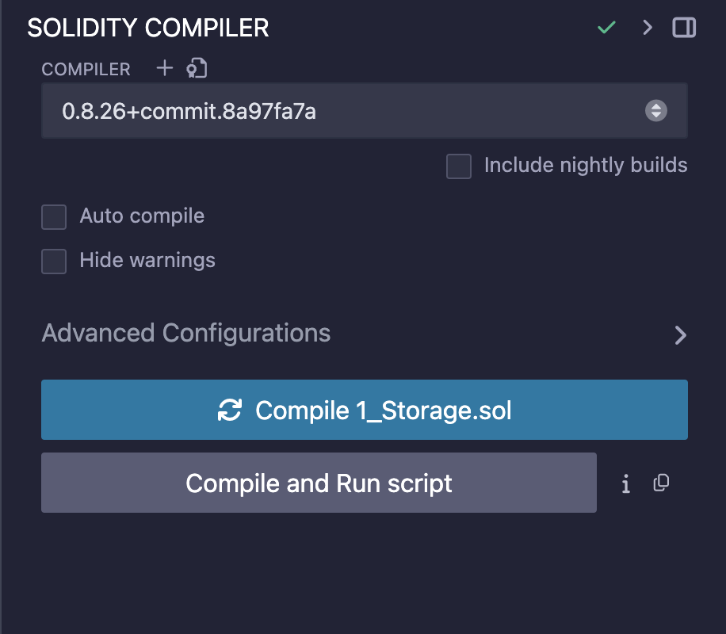

# Tarayıcı Üzerinde Geliştirme

**Remix IDE**, Solidity kontratlarını geliştirmek, test etmek ve dağıtmak için kullanılan güçlü bir web tabanlı araçtır. Remix, Solidity dilinde akıllı kontratlar yazmak ve bu kontratları Ethereum ağı üzerinde test ve dağıtım için kapsamlı bir ortam sağlar. Bu bölümde, Remix IDE'yi kullanarak Solidity kontratlarını nasıl oluşturacağınızı, test edeceğinizi ve dağıtacağınızı adım adım açıklayacağız.


**Dikkat:** Remix IDE'si ile çalışırken sık sık yedekleme yapmanızı öneriyoruz. Nitekim Remix IDE'si tarayıcı üzerinde çerez tabanlı çalışan bir playground olduğu için çerezleriniz yanlışlıkla silindiğinde Remix üzerinde yazdığınız dosyalarınızı kaybedeceğinizi bilmelisiniz.


## Remix IDE Genel Bakış

[Remix IDE Playground](https://remix.ethereum.org/)'a girdiğinizde aşağıdaki gibi bir ekran ile karşılaşacaksınız. Burada en solda bulunan Navigation Menu'den File Explorer, Search, Compiler, Deploy, Debugger ve Git sekmeleri arasında geçiş yapabilirsiniz.

Hemen sağında bulunan `File Explorer` bölümünde yazdığınız kod dosyalarına erişebilirsiniz.\
File Explorer'da bulunan dosyalarda `contracts` adlı dizinde akıllı sözleşmelerinizin dosyaları bulunur. Hemen altındaki `scripts` dizininde ise deploy scriptleri varsayılan olarak yüklü gelir, bunları opsiyonel olarak düzenleyebilirsiniz. Son olarak `tests` dizininde ise akıllı sözleşmeniz için yazacağınız unit testlerin dosyaları bulunur. Bu testler dApp'iniz canlıdayken nasıl davranacağını görmeniz açısından önemlidir. JavaScript kullanarak kontratınızdaki her fonksiyon için test koşulları yazabilirsiniz.

<figure><figcaption>
Remix Genel Bakış
</figcaption></figure>

## Kod Editörü

Ekranın ortasındaki büyük kısımda ise kodlarınızı yazabileceğiniz bir editör bulunmaktadır.

<figure><figcaption>
Kod Editörü
</figcaption></figure>

## Solidity Compiler

En soldaki menüden `Solidity Compiler` bölümüne geçtiğinizde ise yazdığınız kontratın hangi solidity versiyonu ile çalışacağını/compile edileceğini belirtebilirsiniz.&#x20;

Burada belirttiğiniz solidity versiyonunun aynısını kontratınızı kodlarken de kullanacağınızı unutmayın.


Kolaylık olması açısından "Auto compile"ı aktif ederseniz siz kod yazarken herhangi bir hata durumunda editör size uyarı ve tavsiyeler verecektir.


<figure><figcaption>
Compiler Bölümü
</figcaption></figure>

## Debug & Run

Yine sol menüde Compiler'ın hemen altında bulunan `Debug & Run Transaction` bölümünde ise derlenen kontratınızı test edip ilgili blockchain ağına deploy edeceğiniz yani yayınlayabileceğiniz bölüm bulunmaktadır.

* `Environment` kısmında, farklı Remix VM'lerden birini seçebilirsiniz. Bu bölüm tamamen hangi sanal makinayı kullanarak test edeceğiniz ile ilgili olan kısımdır. Dilerseniz `Wallet Connect` seçip Metamask cüzdanınızı bağlayarak gerçek blockchain ortamında da test edebilirsiniz.
* `Account` kısmında ise Virtual Machine'lerden birini seçtiyseniz size içinde test bakiye bulunan bazı test hesapları verilecektir. Kontratınızı bu test hesapları üzerinde gerçekleştirebilirsiniz. Virtual Machine (VM) yerine Metamask cüzdanınızı bağladıysanız burada Metamask cüzdan adresiniz görünecektir.
* `Gas Limit` kısmında ise kontratınızı test ederken ne kadarlık gas fee harcanacağını belirtebileceğiniz kısım bulunmaktadır. İlk aşamalarda burayı değiştirmenize gerek yoktur.
* `Value` kısmında kontratı test/deploy ederken kontratınıza belirli bir bakiye göndermek istediğiniz kullanabilirsiniz.
* `Contract` kısmında varsayılan olarak üzerinde çalıştığınız kontratınızı seçili olarak gelecektir.


Burada ekstra olarak **At Address** butonu bulunmaktadır. Size ait olmayan bir kontratı test etmek ve içeri aktarmak istediğiniz durumlarda input alanına ilgili sözleşmeninin kontrat adresini yazıp At Address diyerek ilgili kontratı içeri aktarabilirsiniz.


<figure><figcaption>
Deploy &#x26; Run Bölümü
</figcaption></figure>

## Debugger

`Debugger` kısmında ise test ettiğiniz kontratın hash kodunu belirtip debug yapabilirsiniz.

<figure><figcaption>
Debugger Bölümü
</figcaption></figure>

## GIT

Ve son olarak da `Git` bölümünden Github bağlantısı kurabilirsiniz. Böylece ister Github üzerinden projenizi içeri aktarabilir isterseniz de Remix üzerinde kodladığınız projenizi Github'a commitleyebilirsiniz.

<figure><figcaption>
GIT Bölümü
</figcaption></figure>
