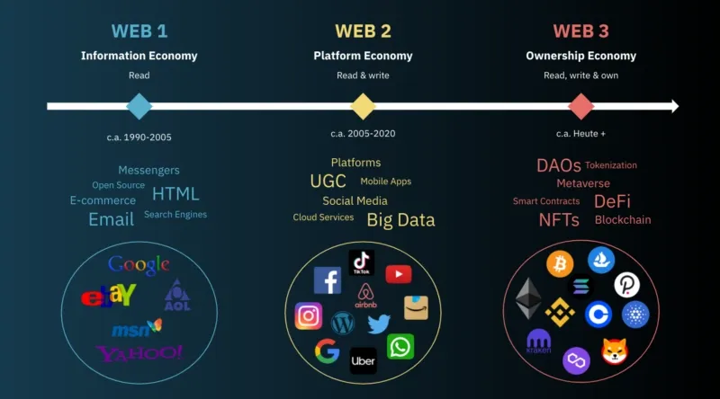

# 👋 Web3 Nedir ?

**Uyarı:** Bu dökümanda yayınlanan kütüphaneler güncel versiyonları yansıtmayabilir, en güncel bilgi için ilgili kütüphanelerin dökümantasyon sayfasını ziyaret edebilirsiniz.

## Giriş

Web3'ü internetin 3. nesli olarak tanımlayabiliriz. Kullanıcıların kendi verilerini kendilerinin kontrol ettiği vizyon üzerine inşaa edilmiş bir anlayıştır.

Web3 ile birlikte hayatımıza bazı yeni konseptler girdi;

* _Merkeziyetsizlik (Decentralization)_

Geleneksel web sitelerinde olduğu gibi kullanıcı verileri Amazon, Google gibi merkezi sunucular yerine Blockchain gibi dağıtık defter teknolojisi üzerinde barındırılmasıdır.

* _Kullanıcı Egemenliği (User Sovereignty)_

Verilerin merkeziyetsizliği ile birlikte belirli bir otorite de ortadan kalkmaktadır. Böylece her kullanıcı hangi veriyi paylaşacağını kendisi belirleyebilir ve kontrol edebilir.

* _Güvenlik ve Gizlilik (Security and Privacy)_

Web3 ile birlikte hayatımıza giren blockchain teknolojisi ile kullanıcı verileri kriptografik yöntemlerle şifrelenmektedir. Bu sayede yüksek seviyede güvenlik ve anonimlik sağlanmaktadır. Veriler, şifreleme ve merkeziyetsiz yapılar sayesinde güvence altına alınmaktadır.


**Web3'ün en önemli ve ana konsepti, kullanıcıların kendi verilerini ve dijital varlıklarını anonim kalarak ve tam olarak kontrol edebilmeleridir.**


## Web2 ve Web3 Arasındaki Fark?

<figure><figcaption>
The Evolution of the Web
</figcaption></figure>

**Web1:** İnternetin ilk dönemleri olarak bildiğimiz Web1 ile birlikte statik ve okuma odaklı web siteleri hayatımıza girdi.

Bu dönemde kullanıcılar bilgiye erişebilir, ancak içerik oluşturamazdı ve etkileşime geçememekteydi.

**Web2:** Facebook, Twitter gibi sosyal medya platformların ortaya çıkmasıyla birlikte dinamik ve etkileşimli bir internet deneyimine kavuştuk. Her kullanıcı artık içerik oluşturabilir, paylaşabilir ve sosyal ağlarda etkileşimde bulunabilmekteydi.

Ancak, bu içerikler hala merkezi sunucularda saklanır ve kontrol edilmektedi.

**Web3:** Günümüzde yeni nesil internet olarak tabir edilen Web3 ile birlikte kullanıcılar merkeziyetsiz ortamlarda anonim olarak içerik oluşturabilir, verileri ve kimlikleri hakkında tam kontrol sahibi olabilirler.

Merkeziyetsiz yapılar daha güvenli ve özgür bir internet sunmaktadır.

Web3, internetin evrimindeki bir sonraki adımı temsil eder ve kullanıcıların daha güvenli, şeffaf ve adil bir dijital dünyaya erişimini sağlar.

## Merkeziyetsiz İnternetin Avantajları

<figure><figcaption></figcaption></figure>

Merkeziyetsiz internet ile birlikte geleneksel organizasyon yapılarında bazı değişiklikler olmuştur. Yukarıdaki görselde belirtilen organizasyon şemalarında merkezi ağ yapısında tek bir koordinasyon noktası bulunduğunu görebilirsiniz. Bu tarz merkezi ağlarda (Facebook, Twitter vs.) tüm veriler ve işlemler tek bir merkezde (sunucuda) toplanır ve yönetilir. Yani tek bir merkezi otoritenin varlığından bahsedebiliriz. Buradaki sıkıntılı nokta verilerin tek bir merkezi konumda bulunması her zaman bir risk barındırır. Merkezi ağlara günümüzdeki mevcut web sitelerini örnek olarak verebiliriz.

Fakat en sağdaki dağıtık yapılarda ise birden fazla koordinasyon noktası bulunur ve veriler birçok düğüm arasında eşit olarak dağıtılır. Her düğüm eşit öneme sahiptir. Dağıtık yapılar, merkezi olmayan ancak koordineli bir yapıya sahip ağlardır. Burada her düğüm/koordinasyon merkezi, kendi başına karar verebilir ve işlemleri gerçekleştirebilir. Dağıtık yapılar, merkeziyetsiz ağlar gibi tek bir zayıf noktaya sahip değildir ve bu nedenle saldırılara karşı daha dirençlidir. Veriler, ağdaki tüm düğümler arasında dağıtılır dolayısıyla daha güvenlidir. Buna yapılara örnek olarak torrent sistemlerini örnek verebiliriz.

Güvenliğin en yüksek düzeyde olduğu merkeziyetsiz ağlarda ise veri ve işlemlerin birden fazla bağımsız düğüm (node) tarafından yönetilir. Her düğüm ağın bir parçası olarak eşit haklara sahiptir ve merkezi bir otorite yoktur.

| Özellik       | Merkezi Ağ                           | Merkeziyetsiz Ağ                   | Dağıtık Ağ                               |
| ------------- | ------------------------------------ | ---------------------------------- | ---------------------------------------- |
| Kontrol       | Tek bir merkezi otorite              | Tüm düğümler arasında eşit         | Birden fazla merkezi sunucu              |
| Güvenlik      | Merkezi sunucunun güvenliği          | Her düğüm kendi verisini saklar    | Birden fazla sunucu arasında             |
| Veri Depolama | Merkezi sunucuda                     | Tüm düğümler arasında dağıtılmış   | Ağdaki tüm düğümler arasında             |
| Avantajlar    | Verimlilik, kolay yönetim            | Dayanıklılık, güvenlik, özerklik   | Dayanıklılık, yük dengelenmesi           |
| Dezavantajlar | Tek nokta hatası, gizlilik sorunları | Yavaş işlem hızı, karmaşık yönetim | Karmaşık koordinasyon, güvenlik açıkları |

**1) Verilerin Kontrolü ve Sahipliği**

Web3 ile birlikte veriler artık kullanıcıların kontrolünde olmaktadır.

**2) Güvenlik ve Anonimlik**

Blockchain ağlarında yaptığınız her işlem geri döndürülemez olduğu için güvenlidir. Her bir işlem blockchain ağına geri döndürülemeyecek ve düzenlenemeyecek şekilde yazılır ve sonsuza dek orada saklanır.\
Ayrıca blockchain ağlarını kullanırken kişisel verilerinizi vermenize gerek kalmadan anonim olarak işlem yapabilirsiniz.

**3) Sansüre Dayanıklılık**

Blockchain ağları dağıtık defter teknolojisi kullandığı için işlem verilerinizin kopyaları merkeziyetsiz bir şekilde farklı ülkelerdeki farklı node'larda barınmaktadır. Dolayısıyla bir manipülasyon veya sansüre karşı dirençlidir.

**4) Ekonomik Katılım ve Eşitlik**

Web3 ile birlikte hayatımıza giren bir diğer konsept ise kullanıcıların ürettiği içeriklerin karşılığında bir ekonomik sistem oluşturulması hedeflenmektedir. Her kullanıcı içerik paylaşarak bir değer üretir. Bu, geleneksel finansal sistemlerde mevcut olan birçok engeli ve eşitsizliği aşmayı amaçlar.

## **Web3'te Ekonomik Katılım**

* **Merkeziyetsiz Finans (DeFi):**
  * DeFi protokolleri, herkesin banka hesabı veya kredi geçmişine bakılmaksızın finansal hizmetlere erişim sağlayabilir. Bu hizmetler arasında borç verme, borç alma, sigorta ve yatırım yer alır.
  * Kullanıcılar, akıllı kontratlar aracılığıyla aracılara ihtiyaç duymadan doğrudan finansal işlemler yapabilir.
* **Tokenizasyon ve Dijital Varlıklar:**
  * Dijital varlıkların tokenizasyonu, geleneksel finansal piyasalara erişimi olmayan bireyler için yeni yatırım fırsatları sunar. Örneğin, gayrimenkul, sanat eserleri ve hatta gelir akışları tokenize edilebilir.
  * Tokenlar, bireylerin projelere erken aşamada yatırım yapmasını ve gelecekteki gelirlerden pay almasını sağlar.
* **NFT'ler (Non-Fungible Tokens):**
  * Sanatçılar, müzisyenler ve diğer yaratıcı profesyoneller, NFT'ler aracılığıyla eserlerini doğrudan dijital olarak satabilir ve gelir elde edebilir. Bu, aracılar olmadan doğrudan gelir sağlama imkanı tanır.
* **DAO'lar (Decentralized Autonomous Organizations):**
  * DAO'lar, merkeziyetsiz ve topluluk odaklı organizasyonlardır. Herkes DAO'lara katılabilir, katkıda bulunabilir ve karar alma süreçlerine dahil olabilir.
  * Bu yapılar, bireylerin projelerin yönetimine ve gelir paylaşımına katılımını sağlar.

## Web3'te Ekonomik Eşitlik

1. **Şeffaflık ve Hesap Verebilirlik:**
   * Blockchain teknolojisi, tüm işlemlerin ve veri değişimlerinin açık ve şeffaf olmasını sağlar. Bu, yolsuzluk ve hileli faaliyetlerin önlenmesine yardımcı olur.
   * Herkes, blockchain üzerindeki işlemleri doğrulayabilir ve denetleyebilir.
2. **Küresel Erişim:**
   * Web3, coğrafi sınırlamaları ortadan kaldırarak herkesin küresel ekonomiyle etkileşime girmesini sağlar. İnternet bağlantısı olan herkes, Web3 uygulamalarına erişebilir.
   * Bu, özellikle bankacılık hizmetlerine erişimi olmayan veya sınırlı olan bölgelerde yaşayan insanlar için büyük bir avantajdır.
3. **Düşük Maliyetler:**
   * Aracıların ortadan kalkması ve akıllı kontratlar sayesinde işlemler daha düşük maliyetlerle gerçekleştirilebilir. Bu, finansal hizmetlere erişimi daha uygun maliyetli hale getirir.
   * Mikro ödemeler ve düşük işlem ücretleri, daha küçük işlemlerin bile ekonomik olarak yapılmasını sağlar.
4. **Topluluk Katılımı ve Yönetimi:**
   * Web3 projeleri, genellikle topluluk tarafından yönetilir ve topluluk üyeleri projelerin gelişiminde söz sahibi olabilir. Bu, projelerin herkesin çıkarına hizmet etmesini sağlar.
   * Token sahipleri, projelerin yönetimine katılarak oy kullanabilir ve karar alma süreçlerine dahil olabilir.

## Örnek Web3 Projeleri ve Uygulamaları

1. **Uniswap ve diğer DeFi Protokolleri:**
   * Merkeziyetsiz borsalar (DEX'ler), herkesin likidite sağlayıcısı olmasını ve ticaret yapmasını sağlar. Aracı olmadan doğrudan kullanıcılar arasında işlem yapılır.
2. **Compound ve Aave:**
   * Bu protokoller, kullanıcıların kripto varlıklarını borç vermesini ve faiz kazanmasını sağlar. Aynı şekilde, borç almak isteyenler de teminat göstererek borç alabilirler.
3. **Gitcoin:**
   * Gitcoin, açık kaynak projelerine finansman sağlamak için merkeziyetsiz bir platformdur. Kullanıcılar, projelere katkıda bulunarak ödüller kazanabilir.
4. **Mirror ve Debank:**
   * Mirror, yazarlara ve içerik oluşturuculara doğrudan ödeme yapılmasını sağlayan bir platformdur. Yazarlar, içeriklerini tokenize edebilir ve doğrudan okuyuculardan gelir elde edebilirler.
   * Debank bir web3 sosyal medya platformudur. Kullanıcılar paylaşım yaparak bir ekonomi oluşturur, diğer kullanıcılar da bu paylaşımlara etkileşim vererek pasif gelir elde edebilirler.

## Hızlı Bağlantılar

Web3 ve Blockchain konularının anlatıldığı teorik bilgileri atlayarak direkt teknik bölüme geçebilirsiniz.


[Broken link](broken-reference)



[Broken link](broken-reference)



[Broken link](broken-reference)

